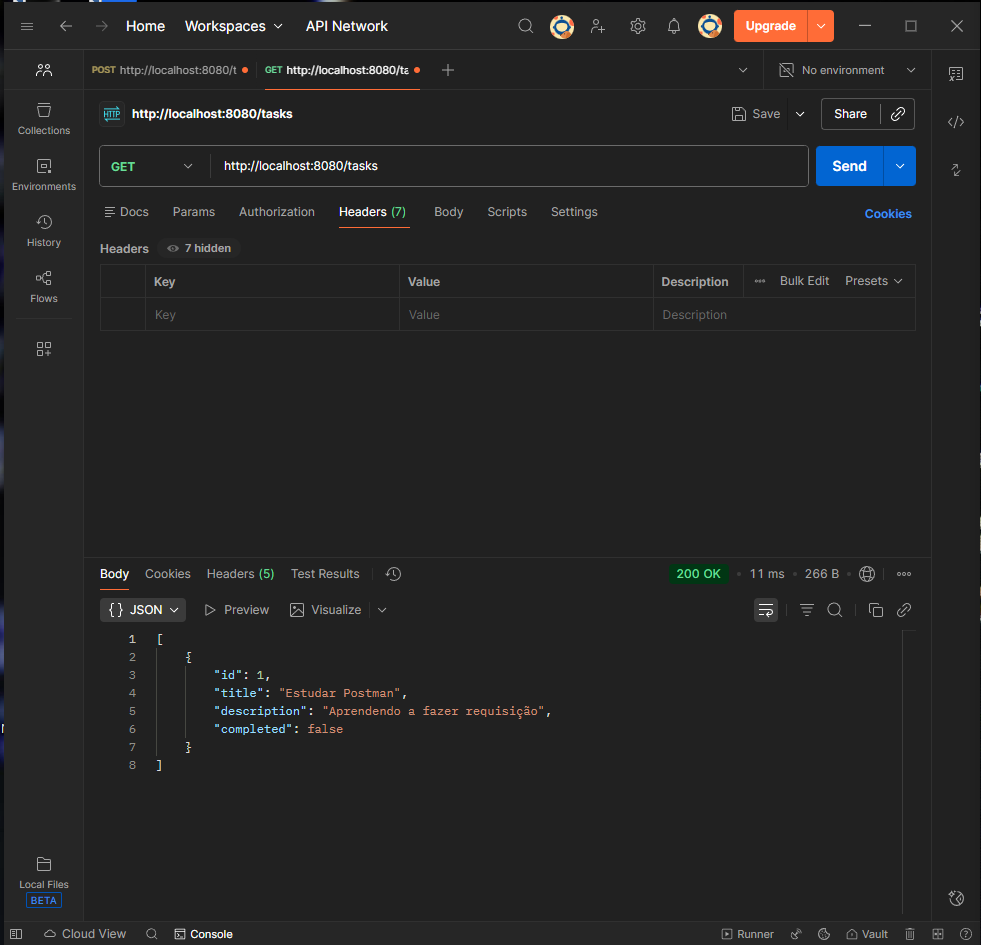
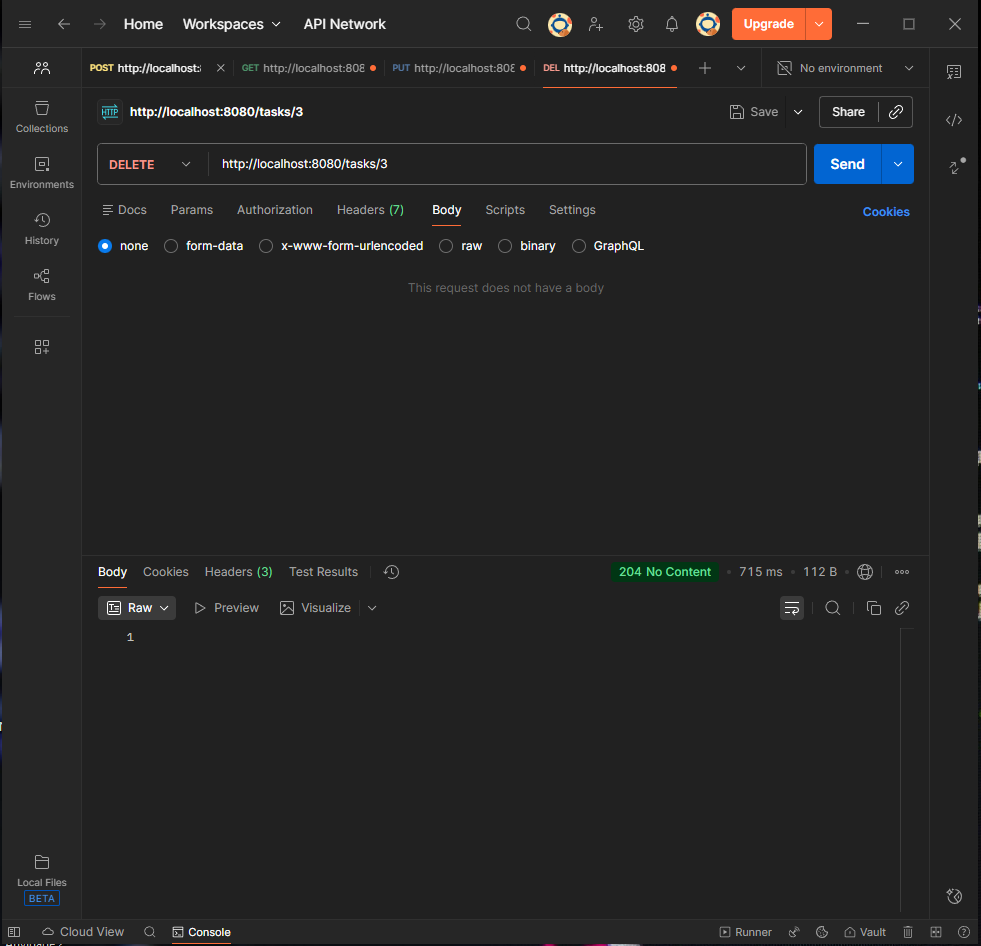

# Minha API de Tarefas (Projeto Task-Manager)

Este projeto demonstra o desenvolvimento de uma API RESTful em duas etapas, conforme as atividades processuais II e III da disciplina Serviços Web API RESTful.

## Tecnologias e Ferramentas

Para fazer o projeto funcionar, eu usei essas ferramentas:

- **Java 17 e Spring Boot 3** (A base do projeto).
- **Spring Web** (Para criar os endpoints da API).
- **Spring Data JPA e H2 Database** (Para persistência de dados).
- **Lombok** (Para economizar código Java).
- **Spring Validation** (Para validação de dados, adicionado na Etapa II).
- **SpringDoc OpenAPI (Swagger UI)** (Para documentação interativa, adicionado na Etapa II).
- **Visual Studio Code e Postman** (Ferramentas de desenvolvimento e teste).

---

## Etapa I: Implementação CRUD Inicial (Atividade Processual II)
Iniciei o projeto implementando as operações CRUD básicas.

### Endpoints Iniciais (Base: /tasks)
A API responde nos seguintes endereços (Base: /tasks):

| Método | Endpoint | Descrição | Status Sucesso |
|---|---|---|---|
| **POST** | /tasks | Cria uma nova tarefa. | 200 OK |
| **GET** | /tasks | Lista todas as tarefas salvas. | 200 OK |
| **PUT** | /tasks/{id} | Atualiza uma tarefa existente. | 200 OK |
| **DELETE** | /tasks/{id} | Exclui uma tarefa pelo ID. | 204 No Content |

### Provas de Teste (Minha Jornada no Postman)

Aqui estão os prints que tirei para provar que os métodos estão funcionando, incluindo a descoberta e correção de erros.

#### 1. Criando a Primeira Tarefa (POST)
Primeiro, testei o POST para adicionar a tarefa "Estudar Postman".

#### 2. Listando a Tarefa Criada (GET)
Usei o GET para confirmar que a tarefa (ID 1) foi salva corretamente.

#### 3. O Erro de Digitação (O null!)
Continuei testando e criando novas tarefas, mas notei que algumas estavam com o título null.

**O que eu aprendi:** Eu descobri que estava digitando "tilte" no JSON em vez de "title". O Spring não deu erro, mas salvou o campo como nulo.

#### 4. Corrigindo o Erro (PUT)
Usei o PUT para consertar o registro de ID 2, que estava com o título nulo.

#### 5. Exclusão da Tarefa (DELETE)
Teste de exclusão da tarefa ID 3. A API retornou o status 204 No Content, confirmando a remoção.

#### 6. Verificando a Lista depois do Delete (GET)
Fiz um novo GET para provar que o ID 3 tinha sumido da lista.

#### 7. Prova Final
Depois de apagar/corrigir todos os erros, este é o print final da lista, mostrando apenas os dados corretos.

---

## Etapa II: Evolução e Aprofundamento (Atividade Processual III e IV)
Nesta etapa, implementei as melhorias de Boas Práticas, Validação de Dados e Documentação.

### 1. Endpoints Atualizados e Boas Práticas (RESTful)
Fiz a atualização do endereço base para **/api/tasks** e o código de status do POST foi corrigido para **201 Created** (conforme as boas práticas REST).

| Método | Endpoint | Descrição | Status Sucesso (Correto) |
| :--- | :--- | :--- | :--- |
| **POST** | /api/v1/tasks | Cria uma nova tarefa. | 201 Created |
| **GET** | /api/v1/tasks | Lista todas as tarefas salvas. | 200 OK |
| **PUT** | /api/v1/tasks/{id} | Atualiza uma tarefa existente. | 200 OK |
| **DELETE** | /api/v1/tasks/{id} | Exclui uma tarefa pelo ID. | 204 No Content |

### 2. Validação e Tratamento de Erros
Para garantir a integridade dos dados da aplicação, implementei duas etapas importantes:

* **Validação:** Adicionei a anotação **@NotBlank** no Model (Task.java) para evitar que campos obrigatórios sejam enviados vazios.
* **Tratamento de Falha:** Criei o arquivo **GlobalExceptionHandler.java** utilizando (@ControllerAdvice) que intercepta automaticamente erros de validação e retorna uma resposta JSON mais clara e amigável para o usuário, sempre que ocorrer um (400 Bad Request).

**Tratamento de 404 Customizado:**
Se eu tentar deletar algo que não existe, o sistema retorna um 404 Not Found com a minha mensagem personalizada.

### 3. Documentação Interativa com Swagger (Diferencial)
Como diferencial, o projeto inclui o **Swagger UI**, permitindo que qualquer pessoa teste os endpoints pelo navegador:  
http://localhost:8080/swagger-ui.html

### 4. Prova Final de Estabilidade
A parte final, com todos os ajustes e validações funcionando, limpa e correta.

---

### Autor(a)

Desenvolvido por **Gabriela Ribeiro Almeida**
